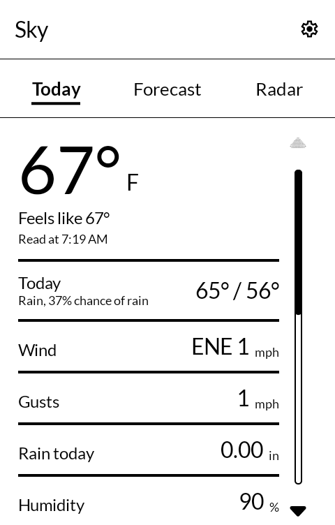
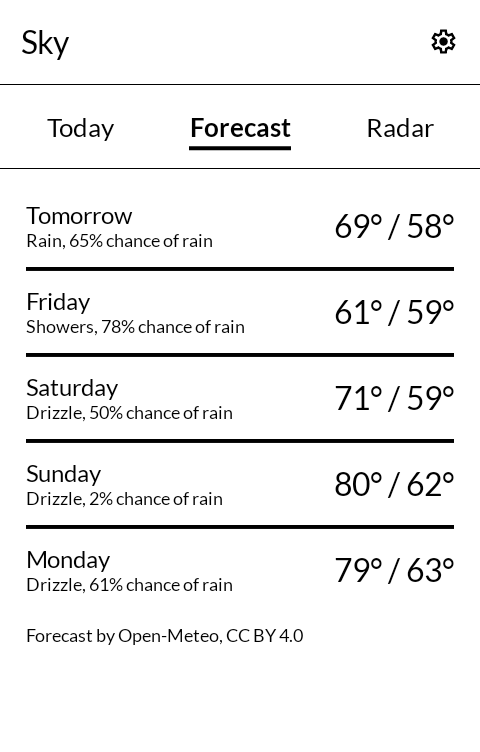
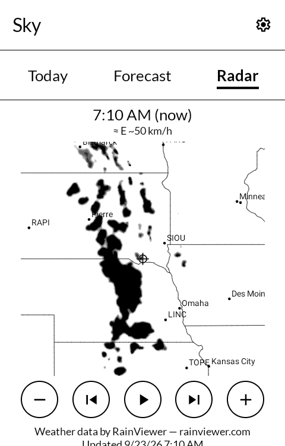
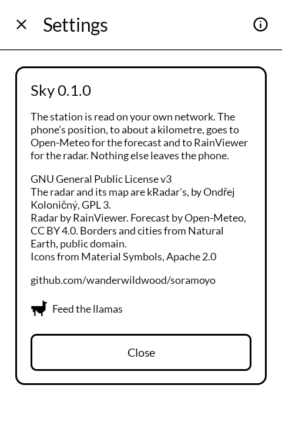

# 空模様 soramoyō — Sky

The days ahead, the rain radar, and your own weather station if you have one, on an
E Ink phone. Built for the [Mudita Kompakt](https://mudita.com/products/kompakt/), and it
will install on any Android 12 device.

*Soramoyō* is 空模様 — the look of the sky, which is how Japanese asks what the weather is
doing. It covers the station and the radar alike, and says no more than either of them
knows.

A fork of [kRadar](https://github.com/ok1cdj/kRadar) by Ondřej Koloničný. The radar is his;
the station and the forecast are added here.

| | |
|---|---|
|  |  |
|  |  |

## What it shows

Three tabs: **Today**, **Forecast** and **Radar**. Today opens.

**The station, if you have one.** Temperature, what it feels like, wind and gusts, rain today
and whether it is falling now, humidity, dew point, pressure and UV, from one of four kinds:

- **An Ecowitt gateway** (and the stations sold under other names that use one), read on your
  own network through the same local page its app uses. No account and no key. Tried on a
  GW3000 with a WS90, and shown in the units the gateway is set to. Soil moisture too, if you
  have a probe.
- **Weather Underground**, for any station that uploads there, which is most makes. Read back
  through Weather Underground's servers, a minute or two behind, with the free API key it
  gives station owners (wunderground.com, your devices, then API keys). ⚠ Those keys expire
  and need renewing on the same page. Tried against a live station.
- **A WeatherFlow Tempest**, heard on your own network: its hub broadcasts a reading about once
  a minute. A Tempest sends no total for the day's rain and no feels-like, so those two are
  not shown for one. **Written from WeatherFlow's published format and not yet tried on a
  real Tempest.**
- **A Davis WeatherLink Live**, read on your own network through its local API. **Written from
  Davis's published format and not yet tried on a real one.**

Tempest and Davis readings are shown in the phone's own units. If you have one and it works,
or does not, an issue here is the way to say so.

Without a station, Today leads with the day's forecast instead.

**The forecast.** Today's high and low and chance of rain sit under the station reading,
with sunrise and sunset; the Forecast tab has the five days after it. From
[Open-Meteo](https://open-meteo.com/), for wherever the phone is or for a place you
choose. Fahrenheit if your station reads Fahrenheit, Celsius if it reads Celsius.

**The radar.** kRadar's radar, unchanged at heart: the last two hours of
[RainViewer](https://www.rainviewer.com/) radar over a vector map centred on the phone, a
locally estimated half hour ahead, marked `≈`, and zoom. State and province lines are drawn
where Natural Earth has them — the US, Canada, Australia and the other large federations —
which kRadar's map leaves out.

**Where it is for.** A Kompakt has no network location, only its GPS, and indoors on a
phone that has never had a fix the GPS may not find itself at all. So in settings the
forecast and the radar can be given a place by name instead — "Portland, Maine",
with the state after a comma to pick one town out of several. While a place is set, the
phone's position is not read.

Away from home a station on your own network cannot be reached, and the screen says so,
keeping the last reading and the time it was taken.

## What it does not do

No history, no charts, no alerts and no widget. It shows what the station reads when you
open it. For a record, most stations can already upload to Weather Underground, Ecowitt and
others.

## What leaves the phone

An Ecowitt, Tempest or Davis station is read on your own network, and nothing it says leaves
the phone. A Weather Underground station is read from Weather Underground, with your key.

The radar and the forecast both need to know roughly where the phone is, or the place you
chose. Either is rounded to two decimal places — about a kilometre — before it leaves the
phone, and it goes to Open-Meteo for the forecast and to RainViewer for the radar tiles. A
place you search for is sent, as typed, to Open-Meteo's place search.

With no place set, if the phone's cached position is more than fifteen minutes old, a fresh
one is asked for before either is fetched, rather than showing the weather for wherever the
phone last was.

## Building

```
./gradlew assembleRelease
```

A release is signed by a keystore in `signing/`, which is not in this repository. Without
it the release APK builds **unsigned** and will not install anywhere — there is no
fallback key by design.

The base map is Natural Earth, baked into `app/src/main/assets/` by
`tools/convert_mapdata.py`, which is kRadar's with state lines added. Regenerate only the
state lines with `python3 tools/convert_mapdata.py --only states`: the committed
`cities.json` carries kRadar's hand-made Czech overlay, which a full run without the
MeteoPlaneRadar sources beside this repo would drop.

## Credit

The radar — the RainViewer client, the e-ink conversion of its tiles, the cloud-motion
forecast, the Web Mercator map and its drawing — is
[kRadar](https://github.com/ok1cdj/kRadar) 1.4 by Ondřej Koloničný (OK1CDJ), GPL v3, and
its history is kept in this repository's. What changed on that side: the screen now sits
in the house top bar with a way back, uses the house type and icons, clips its map to the
square, draws state lines, rounds the position, asks for a fresh fix when the cached one is stale, writes times
the phone's way, and no longer has the hidden test mode.

Radar data by [RainViewer](https://www.rainviewer.com/api.html). Forecast by
[Open-Meteo](https://open-meteo.com/), CC BY 4.0. Borders and cities from
[Natural Earth](https://www.naturalearthdata.com/), public domain. Icons are
[Material Symbols](https://fonts.google.com/icons), Apache License 2.0. The interface is
[MMD](https://github.com/mudita/MMD), Mudita's E Ink component library.

## Licence

GNU General Public License v3, as kRadar is. See [LICENSE](LICENSE).

The radar is Copyright © Ondřej Koloničný. The station, the forecast and the changes are
Copyright © wander wildwood.
